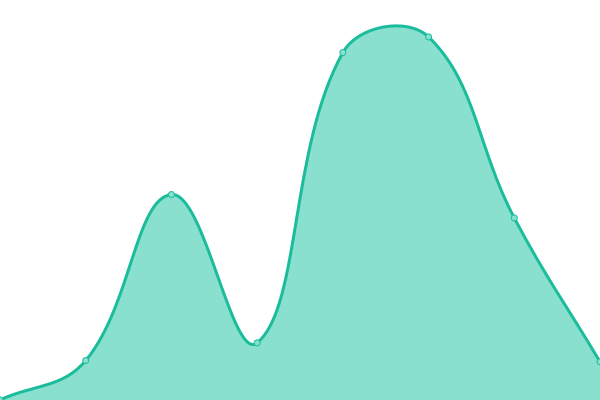

# [📈 Live Status](https://kpop.status.solpl.party): <!--live status--> **🟧 Partial outage**

This repository contains the open-source uptime monitor and status page for [Upptime](https://upptime.js.org), powered by [Upptime](https://github.com/upptime/upptime).

With [Upptime](https://upptime.js.org), you can get your own unlimited and free uptime monitor and status page, powered entirely by a GitHub repository. We use [Issues](https://github.com/upptime/upptime/issues) as incident reports, [Actions](https://github.com/KPOPCORD/status/actions) as uptime monitors, and [Pages](https://kpop.status.solpl.party) for the status page.

<!--start: status pages-->
<!-- This summary is generated by Upptime (https://github.com/upptime/upptime) -->
<!-- Do not edit this manually, your changes will be overwritten -->
<!-- prettier-ignore -->
| URL | Status | History | Response Time | Uptime |
| --- | ------ | ------- | ------------- | ------ |
|  [SMTOWN](https://www.smtown.com) | 🟩 Up | [smtown.yml](https://github.com/KPOPCORD/status/commits/HEAD/history/smtown.yml) | 

 2527ms
     
 | 

<a href="https://kpop-status.cord.town/history/smtown">100.00%</a>
    

|  [SMTOWN Mobile](https://m.smtown.com) | 🟩 Up | [smtown-mobile.yml](https://github.com/KPOPCORD/status/commits/HEAD/history/smtown-mobile.yml) | 

 3160ms
     
 | 

<a href="https://kpop-status.cord.town/history/smtown-mobile">100.00%</a>
    

|  [DearU](http://www.dear-u.co) | 🟩 Up | [dear-u.yml](https://github.com/KPOPCORD/status/commits/HEAD/history/dear-u.yml) | 

 992ms
     
 | 

<a href="https://kpop-status.cord.town/history/dear-u">100.00%</a>
    

|  [Lysn](http://www.lysn.com) | 🟥 Down | [lysn.yml](https://github.com/KPOPCORD/status/commits/HEAD/history/lysn.yml) | 

 1019ms
     
 | 

<a href="https://kpop-status.cord.town/history/lysn">0.00%</a>
    

|  [YG LIFE](https://yg-life.com/?lang=ko) | 🟥 Down | [yg-life.yml](https://github.com/KPOPCORD/status/commits/HEAD/history/yg-life.yml) | 

 15472ms
     
 | 

<a href="https://kpop-status.cord.town/history/yg-life">0.00%</a>
    

|  [JYP Ent.](https://www.jype.com) | 🟩 Up | [jyp-ent.yml](https://github.com/KPOPCORD/status/commits/HEAD/history/jyp-ent.yml) | 

 1107ms
     
 | 

<a href="https://kpop-status.cord.town/history/jyp-ent">100.00%</a>
    

|  [BIGHIT MUSIC](https://ibighit.com) | 🟩 Up | [bighit-music.yml](https://github.com/KPOPCORD/status/commits/HEAD/history/bighit-music.yml) | 

 95ms
     
 | 

<a href="https://kpop-status.cord.town/history/bighit-music">100.00%</a>
    

|  [Weverse](https://www.weverse.io) | 🟩 Up | [weverse.yml](https://github.com/KPOPCORD/status/commits/HEAD/history/weverse.yml) | 

 1653ms
     
 | 

<a href="https://kpop-status.cord.town/history/weverse">100.00%</a>
    

|  [Weverse Magazine](https://magazine.weverse.io) | 🟩 Up | [weverse-magazine.yml](https://github.com/KPOPCORD/status/commits/HEAD/history/weverse-magazine.yml) | 

 733ms
     
 | 

<a href="https://kpop-status.cord.town/history/weverse-magazine">100.00%</a>
    

|  [Cube Ent.](http://www.cubeent.co.kr) | 🟩 Up | [cube-ent.yml](https://github.com/KPOPCORD/status/commits/HEAD/history/cube-ent.yml) | 

 2432ms
     
 | 

<a href="https://kpop-status.cord.town/history/cube-ent">100.00%</a>
    

|  [U CUBE](https://united-cube.com) | 🟩 Up | [u-cube.yml](https://github.com/KPOPCORD/status/commits/HEAD/history/u-cube.yml) | 

 190ms
     
 | 

<a href="https://kpop-status.cord.town/history/u-cube">100.00%</a>
    

|  [FNC Ent.](https://www.fncent.com) | 🟩 Up | [fnc-ent.yml](https://github.com/KPOPCORD/status/commits/HEAD/history/fnc-ent.yml) | 

 1858ms
     
 | 

<a href="https://kpop-status.cord.town/history/fnc-ent">99.84%</a>
    

<!--end: status pages-->

[**Visit our status website →**](https://kpop.status.solpl.party)

## 📄 License

- Powered by: [Upptime](https://github.com/upptime/upptime)
- Code: [MIT](./LICENSE) © [Upptime](https://upptime.js.org)
- Data in the `./history` directory: [Open Database License](https://opendatacommons.org/licenses/odbl/1-0/)
